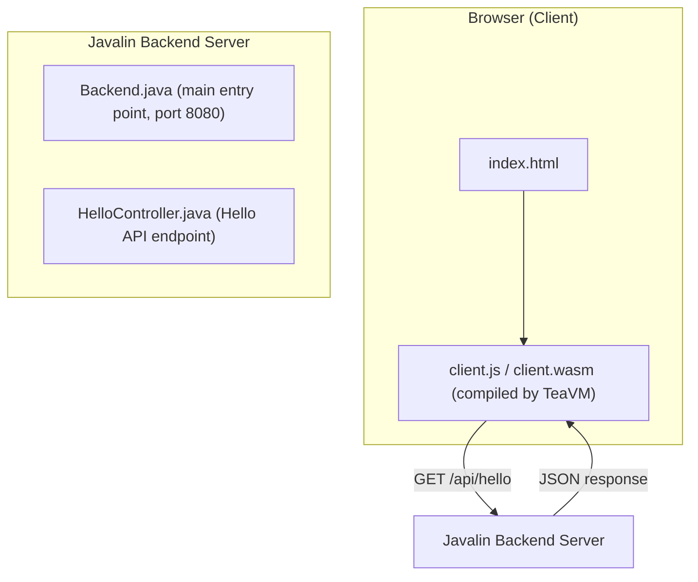
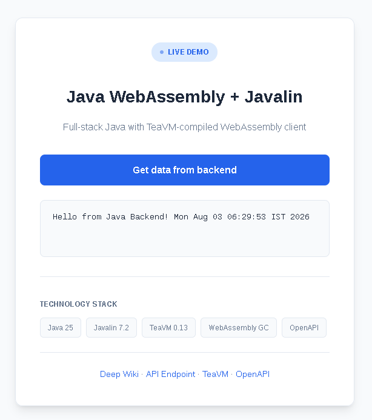

# Java WebAssembly + Javalin Playground

Full-stack Java application demonstrating WebAssembly and JavaScript compilation from Java using TeaVM, with a Javalin backend.

## Architecture



## Technologies

- **Java 25** (with `--enable-preview` JVM arg)
- **Javalin 7.2.2** - Lightweight web framework
- **TeaVM 0.13.0** - Java to WebAssembly/JavaScript compiler
- **OpenAPI** - API documentation at `/api/hello`

## Project Structure

```
├── build.gradle.kts              # Gradle build configuration
├── src/
│   ├── main/java/scorta/
│   │   ├── Backend.java          # Main backend class, starts Javalin server
│   │   ├── HelloController.java  # REST API controller
│   │   └── Frontend.java         # TeaVM-compiled client code
│   └── main/resources/public/
│       ├── index.html            # Client HTML page
│       ├── js/client.js          # Compiled JavaScript
│       └── wasm-gc/client.wasm # Compiled WebAssembly
└── README.md
```

## Prerequisites

- Java 25+ with preview features enabled
- Gradle 8+

## Quick Start

```bash
# Build and run
./gradlew generateJavaScript generateWasmGC run

# Or run individual tasks:
./gradlew generateJavaScript  # Compile Frontend.java to client.js
./gradlew generateWasmGC      # Compile Frontend.java to client.wasm
./gradlew run                 # Start Javalin backend on port 8080
```

## Endpoints

| Method | Path       | Description              |
|--------|------------|--------------------------|
| GET    | `/api/hello` | Returns greeting with timestamp |
| GET    | `/`        | Serves index.html         |
| GET    | `/js/client.js` | Client-side JavaScript |
| GET    | `/wasm-gc/client.wasm` | Client-side WebAssembly |

## Open API Documentation

Access Swagger UI at: http://localhost:8080/openapi/swagger-ui/index.html

## Usage

1. Open browser to `http://localhost:8080`
2. Click "Get data from backend" button
3. The frontend makes an AJAX request to the backend and displays the response

## Build Tasks

| Task              | Output                          |
|-------------------|---------------------------------|
| `generateJavaScript` | `src/main/resources/public/js/client.js` |
| `generateWasmGC`     | `src/main/resources/public/wasm-gc/client.wasm` |
| `run`                | Starts Javalin server on port 8080 |
| `shadowJar`          | Creates fat JAR with all dependencies |

## Troubleshooting

**Port 8080 already in use**: Kill the process using that port or change the port in `Backend.java`.

**Java 25 not available**: Ensure you have Java 25+ installed. The project uses preview features.

**TeaVM compilation errors**: Check that `teavm-tooling` dependency is correctly configured in `build.gradle.kts`.

## Deep Wiki

https://deepwiki.com/sco3/javawasm-playground

## Screenshot

